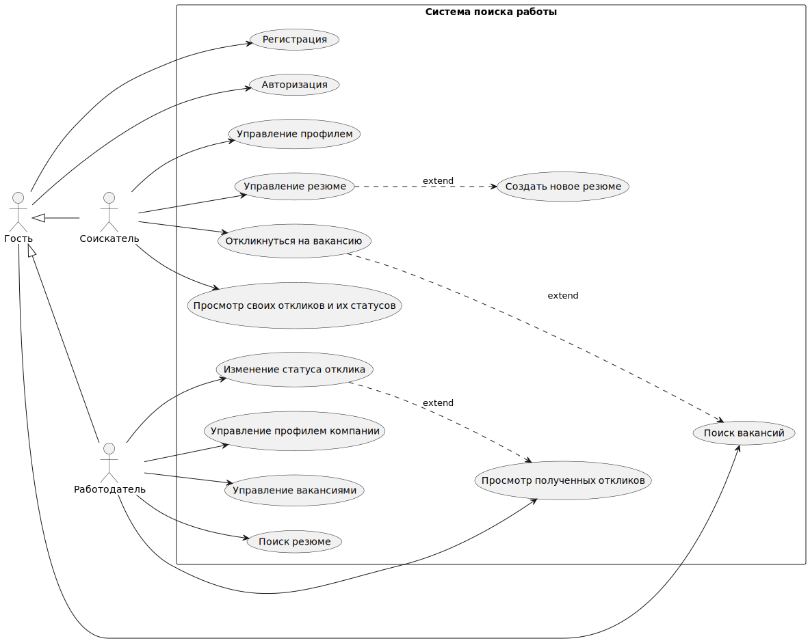
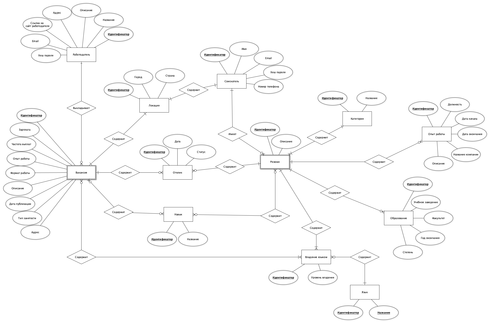
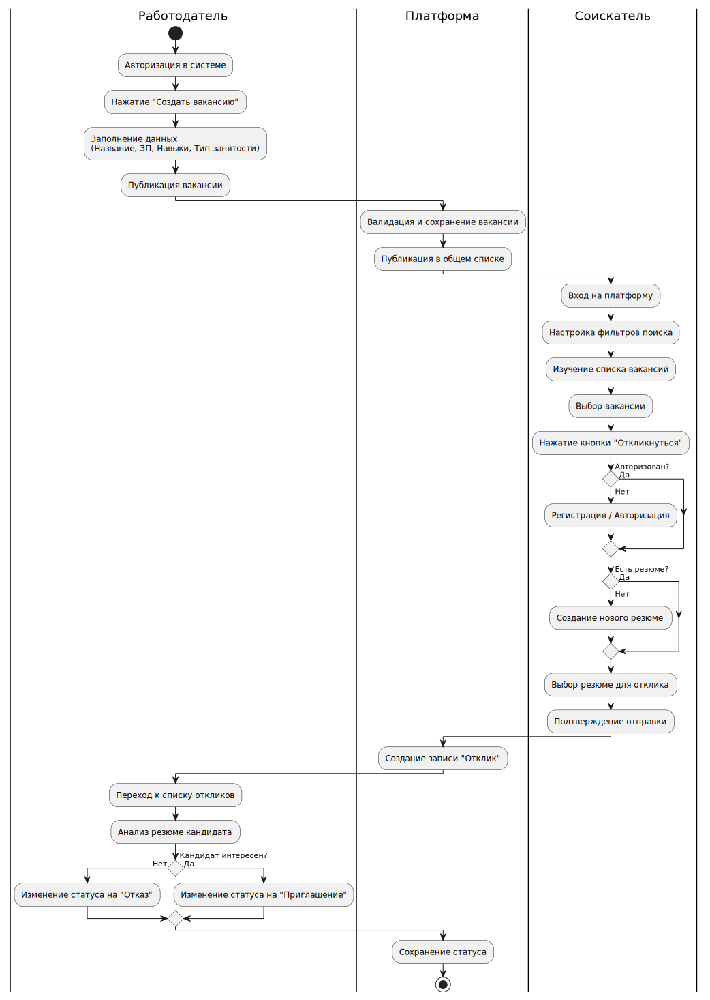
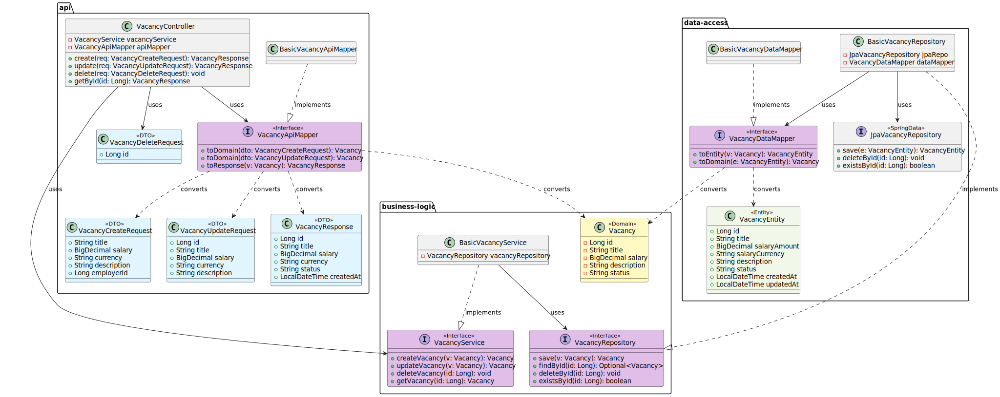
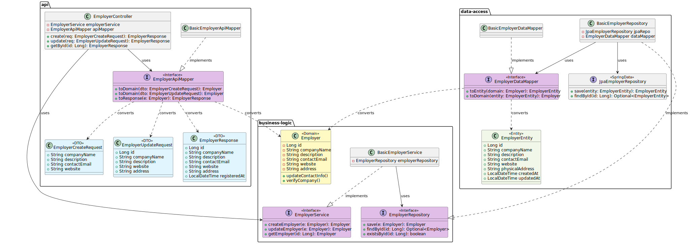
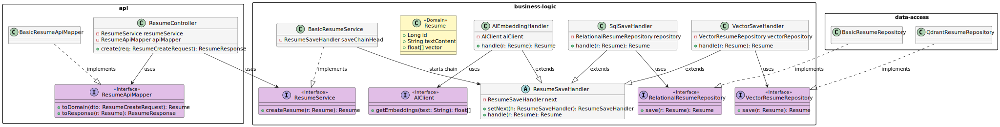
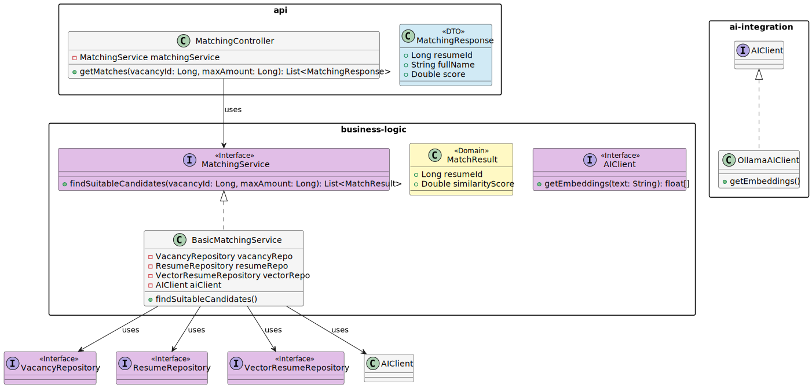
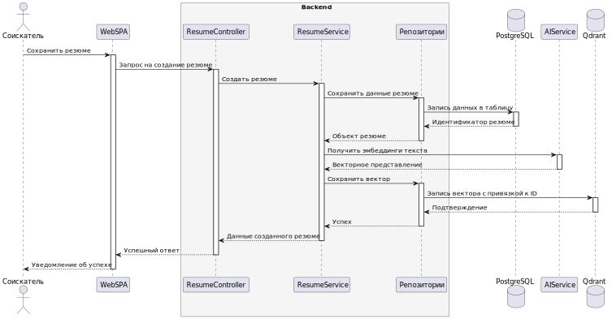
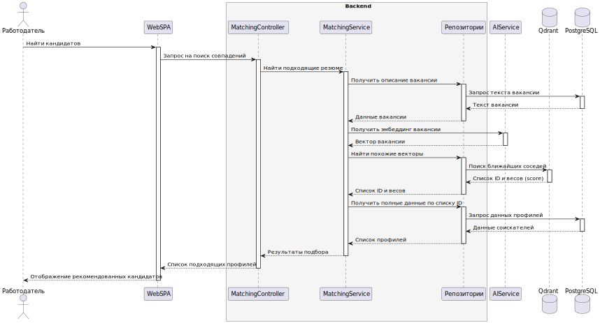
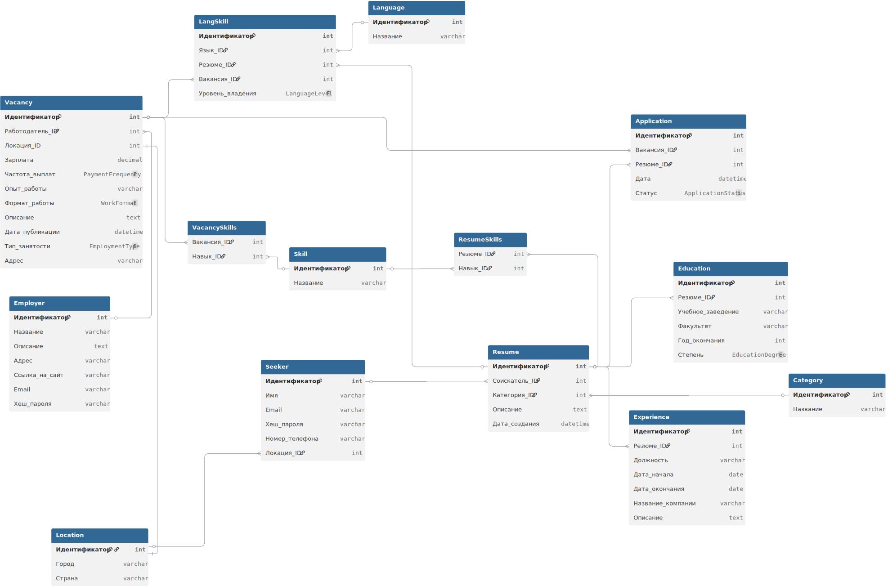

Проект: JobFinder

# Краткое описание проекта
Необходимо создать приложение для поиска работы. В приложении должна быть обеспечена возможность как поиска работы со стороны соискателя, так и поиск соискателя со стороны работодателя. Требуется добавить уникальную "фишку" сервиса --- использование систем искуственного интеллекта для поиска соискателя по описанию.

# Анализ предметной области
Существуют соискатели и работодатели. У соискателей есть резюме. Работодатели размещают вакансии, на которые соискатели могут оставлять отклики с прикреплением резюме. В резюме должно указываться владение языками, технические навыки, категория (IT, закупки, маркетинг и т.д.), опыт работы и образование.

# Анализ аналогичных решений
Сначала необходимо сформулировать критерии сравнения.

1. Доступность в РФ. Является одиним из самых важных критериев, потому что предлагаемый сервис ориентирован на пользователей из России. Платформа должна предоставлять доступ для пользователей без применениия сторонних инструментов.

2. Открытое API. Наличие открытого доступа к API помогает работодателю использовать сервис в своей внутренней системе.
с
3. Средства автоматизированного поиска соискателей. Наличие подобных средств снижает нагрузку работодателя при поиске сотрудников.

| Платформа     | Доступность в РФ | Открытое API | Средства автоматизированного поиска соискателей |
|---------------|---------------|-----|--------------------|
| hh.ru         | Да            | Да  | За отдельную плату  |
| LinkedIn      | Ограничена    | Нет | За отдельную плату  |
| Glassdoor     | Ограничена    | Нет | Нет                 |
| Habr Карьера  | Да            | Нет | Нет                 |

# Целесообразность и актуальность
JobFinder актуален, так как предлагает бесплатную доступную в РФ платформу с применением автоматизированных средств поиска соискателей с применением новых технологий на основе систем искуственного интеллекта.

# Акторы

1. Гость. Незарегестрированный пользователь, который может просматривать выложенные вакансии, либо зарегестрироваться/авторизоваться.

2. Соискатель. Может составлять и изменять резюме, откликаться на вакансии. просматривать статусы своих откликов и выполнять те же действия что и гость.

3. Работодатель. Может выкладывать вакансии, изменять состояния полученных откликов и выполнять те же действия, что и гость.

# Use-case диаграмма

# ER-диаграмма сущностей

# Пользовательские сценарии

## Публикация вакансии и отработка отклика
Алгоритм:
1. Авторизация;
2. Нажатие кнопки создать вакансию;
3. Заполнение данных вакансии: названия, зарплаты, тип занятости, формата работы, описания, требуемых навыков;
4. Нажатие кнопки публикации;
5. Получение отклика от соискателя;
6. Анализ кандидата;
7. Изменение статуса отклика.

## Поиск работы с использованием фильтров
Алгоритм:
1. Авторизация;
2. Настройка фильтров вакансии поиска
3. Нажатие кнопки поиск;
4. Изучение вакансий;
5. Нажатие кнопки отклика на интересующей вакансии;
6. Выбор резюме для отклика;
7. Нажатие кнопки подтвердить.

## Поиск работы гостем
Алгоритм:
1. Настройка фильтров вакансии поиска
2. Нажатие кнопки поиск;
3. Изучение вакансий;
4. Нажатие кнопки отклика на интересующей вакансии;
5. Регистрация;
6. Создание резюме;
7. Выбор резюме для отклика;
8. Нажатие кнопки подтвердить.

# Формализация ключевых бизнес-процессов

# Тип приложения
Web SPA
Backend: Java (SpringBoot)
Frontend: TypeScript (React)

# C4
## Context диаграмма

## Container диаграмма

## Component диаграмма

## Code диаграммы
### UML диаграмма классов для модуля вакансий

### UML диаграмма классов для модуля работодателей

### UML диаграмма классов для модуля резюме

### UML диаграмма классов для модуля умного поиска

# Sequence диаграммы
## Sequence диаграмма сохранения резюме

## Sequence диаграмма использования системы автоматизированного поиска

# DBML схема
